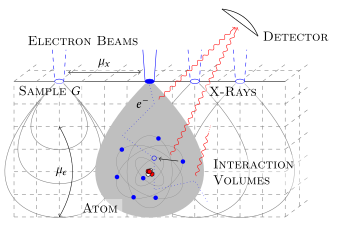

# PNEPMA

[EPMA (Electron Probe Microanalysis)](https://en.wikipedia.org/wiki/Electron_microprobe) is a non-destructive method to determine the chemical composition of a material sample.
An electron beam bombards the sample, which subsequently emits detectable x-radiation.
From measured x-ray intensities, the chemical composition is reconstructed.

We aim to implement the reconstruction as a minimization problem, where k-ratios (normalized x-ray intensities) simulated by a model are fitted to experimental data.
Here we use the PN-model to approximate the stationary linear Boltzmann equation (radiative transfer) including a CSD (continuous-slowing-down approximation) together with a subsequent k-ratio model.

We use a staggered grid finite difference approach for the discretization of the pde and implement gradients using the adjoint state method.

Note that this code is intended for reasearch, hence mostly undocumented.

For further information see:

- [1] J. Bünger, S. Richter, and M. Torrilhon, “A Model for Characteristic X-Ray Emission in Electron Probe Microanalysis Based on the (Filtered) Spherical Harmonic () Method for Electron Transport,” Microsc Microanal, vol. 28, no. 2, pp. 454–468, Apr. 2022, doi: 10.1017/S1431927622000083.
- [2] B. Seibold and M. Frank, “StaRMAP---A Second Order Staggered Grid Method for Spherical Harmonics Moment Equations of Radiative Transfer,” ACM Trans. Math. Softw., vol. 41, no. 1, pp. 1–28, Oct. 2014, doi: 10.1145/2590808.
- [3] J. Bünger, “Three-dimensional modelling of x-ray emission in electron probe microanalysis based on deterministic transport equations,” RWTH Aachen University, 2021. doi: 10.18154/RWTH-2021-05180.

## Dependencies
This software is implemented in [julia](http://julialang.org). We provide a Manifest and Project file to automatically load the required dependencies into your environment.